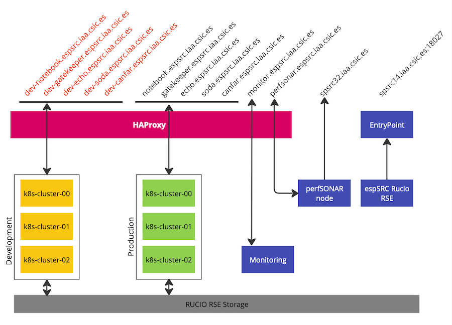
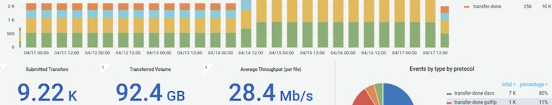
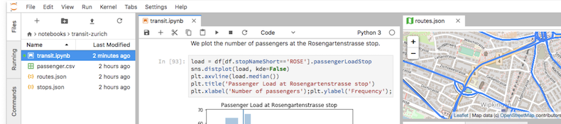
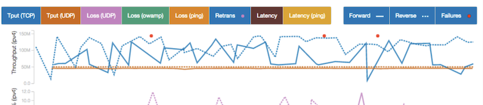
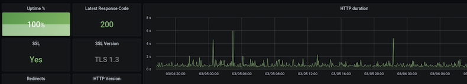
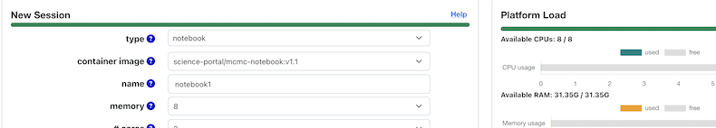

.. espSRC docs

espSRC Services Deployment
==========================

Welcome to the espSRC services documentation for SRCNet v0.1. 
In this document you will find all the services deployed within 
espSRC and their configuration and instantiation details based on 
GitOps, Helm, Docker of manual.

.. toctree::
   :hidden:

   self

.. toctree::
  :caption: GitOps deployment
  :maxdepth: 2
  :hidden:

  deployments/gitops/gitops

.. toctree::
  :caption: Rucio RSE
  :maxdepth: 2
  :hidden:

  deployments/rse/manual
  deployments/rse/helm
 

espSRC Rucio RSE
----------------

The espSRC is integrated as a RSE (Rucio Storage Element) within the SKAO Rucio data lake. 
The RSE deployment of the espSRC consists of a VM that mounts to a CephFS-based mass storage space. 
The implementation used for the RSE within the espSRC is based on WebDav, specifically the StoRM-WebDav setup (manual and helm [on kubernetes]).
Currently the service is connected through a proxy that redirects requests from users to the service itself.

- StoRM-WebDav deployment - Manual :doc:`./deployments/rse/manual` , version of StoRM WebDav: 1.4.2
- StoRM-WebDav deployment - Helm :doc:`./deployments/rse/helm` , version of StoRM WebDav: 1.1.1
- Installation reproducibility: |:white_check_mark:| Manual and |:warning:| Helm (in progress)
- Storage size: **10TB**
- Integrations: 
   | |:white_check_mark:| SKAO-IAM - `Client SKAO-IAM <https://ska-iam.stfc.ac.uk/dashboard#!/home/clients>`_
   | |:white_check_mark:| SKAO Data lake  
   | |:white_check_mark:| Site Capabilities - `ESPSRC <https://site-capabilities.srcdev.skao.int/api/v1/www/docs/oper#get-/sites/-site->`_
   | |:white_check_mark:| Functional tests
   | |:white_check_mark:| SKAO Rucio Monitoring system - `monit.srcdev.skao.int <https://monit.srcdev.skao.int/grafana/d/BfW0IQQVk/rucio-events?orgId=1>`_
- Support: @Jesús Sánchez and @Manu Parra

**Endpoints for this service:**

.. note::
  | EndPoint 1: https://spsrc14.iaa.csic.es:18027/disk
  | (|:warning:|) Endpoint 2: https://rucio.espsrc.iaa.csic.es - in progress

.. toctree::
  :caption: JupyterHub
  :maxdepth: 2
  :hidden:
  
  deployments/jupyterhub/helm
  deployments/jupyterhub/gitops
 
JupyterHub
----------

JupyterHub provides an interactive and collaborative notebook environment for doing science in a very dynamic 
and visual way. It offers a complete working environment that supports any customisation of programming languages, 
access to a console and scalable computing power. The espSRC is deployed within a Kubernetes cluster (one for production 
and one for development) and a notebooks service with JupyterHub. Access to this service is provided through a HAProxy 
load balancing service. The storage provisioning model of the user accounts is carried out through a StorageClass with a CephFS backend. 
For the production notebooks service, the Rucio Storage Element of the espSRC storage has not been set up, but for the development cluster, 
the RSE has been set up for testing purposes. 

- JupyterHub deployment - Helm :doc:`./deployments/jupyterhub/helm` , version: 3.1.0
- JupyterHub deployment - via GitOps :doc:`./deployments/jupyterhub/gitops` , version: 3.1.0 
- Installation reproducibility: |:white_check_mark:| Helm and |:white_check_mark:| GitOps 
- Storage size for users: **20TB** (extendable)
- Integrations: 
   | |:white_check_mark:| SKAO-IAM - `Client SKAO-IAM <https://ska-iam.stfc.ac.uk/dashboard#!/home/clients>`_
   | |:white_check_mark:| Site Capabilities - `ESPSRC <https://site-capabilities.srcdev.skao.int/api/v1/www/docs/oper#get-/sites/-site->`_
   | |:white_check_mark:| Access/Mounted espSRC RSE for the development cluster (https://dev-notebook.espsrc.iaa.csic.es)
- Support: @Manu Parra

**Endpoints for this service:**

.. note::
  | EndPoint: https://notebook.espsrc.iaa.csic.es
  | EndPoint development: https://dev-notebook.espsrc.iaa.csic.es

.. toctree::
  :caption: SODA Service
  :maxdepth: 2
  :hidden:
  
  deployments/soda/docker
  deployments/soda/helm

SODA Service
------------

Server-side Operations for Data Access (SODA) is a low-level data access capability and a server side data processing 
that can act upon the data files, performing various kinds of operations: filtering/subsection, transformations, pixel 
operations, and applying several other functions to the data. As part of SRCNet 0.1, this service is provided locally
within the SRC and will not be exposed like others. Additional external services may make use of the SODA service 
through e.g. the GateKeeper service (see description and installation). This deployment is currently running on a VM 
that is and the load balancing service is in charge of exposing the service externally/locally. 

- VisIVO SODA - Docker :doc:`./deployments/soda/docker` , version of VisIVO Soda Server: 1.7.0
- VisIVO SODA - Helm :doc:`./deployments/soda/helm` , version of VisIVO Soda Server: 1.7.0
- Installation reproducibility: |:white_check_mark:| Docker and |:warning:| Helm (in progress)
- Storage size: Same of the espSRC RSE (10TB)
- Integrations: 
   | |:white_check_mark:| SKAO-IAM - `Client SKAO-IAM <https://ska-iam.stfc.ac.uk/dashboard#!/home/clients>`_
   | |:white_check_mark:| Site Capabilities - `ESPSRC <https://site-capabilities.srcdev.skao.int/api/v1/www/docs/oper#get-/sites/-site->`_
   | |:white_check_mark:| Access/Mounted espSRC RSE. 
- Support: @Manu Parra

**Endpoint for this service:**

.. note::
  | EndPoint: https://soda.espsrc.iaa.csic.es/ska/datasets/soda (currently exposed externally)
  | EndPoint capabilities: https://soda.espsrc.iaa.csic.es/ska/datasets/availability (currently exposed externally)

.. GateKeeper documentation start point 
   --------------------------------------------

.. toctree::
  :caption: GateKeeper
  :maxdepth: 2
  :hidden:
  
  deployments/gatekeeper/helm

GateKeeper Service
------------------

GateKeeper is the SRCNet service that is installed locally in all SRCs and is 
responsible for providing other local SRC services with authentication and 
authorisation mechanisms at the outermost layer of the SRC, thus delegating to 
the SRC the functionalities for permission control and DataManagement API management for the rest of the 
services within the internal/local SRC. For this service in the espSRC, a Helm-based 
installation on the Kubernetes cluster has been used. 
The service is exposed externally to the internet via the HAProxy load balancer.

- GateKeeper - Helm :doc:`./deployments/gatekeeper/helm`
- Installation reproducibility: |:white_check_mark:| Helm and |:warning:| GitOps (in progress)
- Integrations: 
   | |:white_check_mark:| SKAO-IAM - `Client SKAO-IAM <https://ska-iam.stfc.ac.uk/dashboard#!/home/clients>`_
   | |:white_check_mark:| Site Capabilities - `ESPSRC <https://site-capabilities.srcdev.skao.int/api/v1/www/docs/oper#get-/sites/-site->`_
- Support: @Manu Parra

.. note::
  | EndPoint: https://gatekeeper.espsrc.iaa.csic.es (in progress)

.. PerfSONAR documentation start point 
   --------------------------------------------

.. toctree::
  :caption: PerfSONAR
  :maxdepth: 2
  :hidden:
  
  deployments/perfsonar/manual

PerfSONAR Service
-----------------

The monitoring of the SRCNet service infrastructure involves monitoring the 
services exposed both locally and externally. As a fundamental part of monitoring, 
it is necessary to use tools that allow measuring the state of connectivity between 
the different SRCs at network level, bandwidth, etc. For this purpose, the perfSONAR 
tool has been installed in the espSRC, through which different network tests are 
executed from another of the nodes between all the other SRCs, in order to know 
the general state of the SRC network. This deployment has been done using a VM 
dedicated entirely for this use, it has a direct connection to the network of 
our institute and is not behind HAproxy. It has all the input/output ports required 
for the correct functioning of perfSONAR enabled. 

- PerfSONAR - Manual :doc:`./deployments/perfsonar/manual`
- Installation reproducibility: |:white_check_mark:| Manual
- Integrations: 
   | |:white_check_mark:| Site Capabilities `ESPSRC <https://site-capabilities.srcdev.skao.int/api/v1/www/docs/oper#get-/sites/-site->`_
   | |:white_check_mark:| Global PerfSONAR Dashboard - `Grafana-perfSONAR <https://perfsonar01.jc.rl.ac.uk/grafana/d/c81bcc51-9380-5365-a398-b2e0fc9df648/custom-grafana-dashboard?orgId=1>`_
- Support: @Jesús Sánchez 

.. note::
  | EndPoint: https://spsrc32.espsrc.iaa.csic.es  
  | EndPoint: https://perfsonar.espsrc.iaa.csic.es (Grafana local interface)

.. Local Monitoring documentation start point 
  --------------------------------------------

.. toctree::
  :caption: Local monitoring
  :maxdepth: 2
  :hidden:
  
  deployments/monitoring/docker

Local Monitoring Service
------------------------

The monitoring of the SRCNet service infrastructure involves the 
supervision of the services exposed both locally and externally. 
The installation of service monitoring allows at a glance to review 
the overall status of all functionalities available on the espSRC. 
For this purpose, Prometheus has been deployed, with BlackBox Exporter 
together with Grafana inside a separate VM, to manage the monitoring 
and metrics of the status of the services deployed in espSRC. In addition 
to the status of the services, the status of all the VMs and Clusters of 
espSRC is monitored. Access to these monitoring services for visualisation 
is integrated with SKAO-IAM. 

- Monitoring - Docker :doc:`./deployments/monitoring/docker`
- Installation reproducibility: |:white_check_mark:| Docker
- Integrations: 
   | |:white_check_mark:| SKAO-IAM - `Client SKAO-IAM <https://ska-iam.stfc.ac.uk/dashboard#!/home/clients>`_
   | |:white_check_mark:| Site Capabilities - `ESPSRC <https://site-capabilities.srcdev.skao.int/api/v1/www/docs/oper#get-/sites/-site->`_
   | |:white_check_mark:| SRCNet Global Monitoring - `Platform <https://grafana.dev.skach.org/d/site_specific_services/central-monitoring-srcnet-site-services?orgId=1&from=now-5m&to=now&var-sitename=ESPSRC&var-environment=prod>`_
   | |:white_check_mark:| Local Monitoring - `Platform <https://monitor.espsrc.iaa.csic.es>`_
- Support: @Jesús Sánchez 
.. note::
  | EndPoint: https://monitor.espsrc.iaa.csic.es

.. prepareData documentation start point 
  --------------------------------------------

.. toctree::
  :caption: PrepareData
  :maxdepth: 2
  :hidden:
  
  deployments/preparedata/docker

PrepareData Service
-------------------

TBC - Deployment :doc:`./deployments/preparedata/docker`. 

.. Documentation on CANFAR deployment start point
  --------------------------------------------

.. toctree::
  :caption: CANFAR Science platform
  :maxdepth: 2
  :hidden:
  
  deployments/canfar/helm

CANFAR Science Platform
-----------------------

The CANFAR science platform provides a set of components such as notebooks, 
shells, desktops, and other containerised tools and services from a web interface 
through which to interact. This platform is installed inside a Kubernetes cluster 
and all its services are exposed through a load balancer with HAproxy. The production 
version of CANFAR on the espSRC does not have access to the RSE content of the espSRC. 
Another Kubernetes development cluster does provide CANFAR with access to the RSE 
content of the espSRC.

- CANFAR - Helm :doc:`./deployments/canfar/helm`
- Installation reproducibility: |:white_check_mark:| Helm and |:warning:| GitOps (in progress)
- Integrations: 
   | |:white_check_mark:| SKAO-IAM - `Client SKAO-IAM <https://ska-iam.stfc.ac.uk/dashboard#!/home/clients>`_
   | |:white_check_mark:| Site Capabilities - `ESPSRC <https://site-capabilities.srcdev.skao.int/api/v1/www/docs/oper#get-/sites/-site->`_
   | |:white_check_mark:| GMS - Registry
- Support: @Manu Parra and @Jesus Sánchez

.. note::
  | EndPoint: https://canfar.espsrc.iaa.csic.es/science-portal/